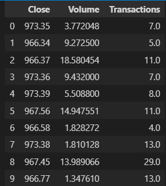

# Introduction

This report entails the details of the actvities that have been carried out in the first weeks prior of the project to submission. The report is divided into three sections: the research strategy, data collection and data cleaning.

# Research Strategy

## Brief Overview of the Project
The main objective of this research is to compare the performance of the purely LSTM model with the Neural Prophet model by META (formerly known as Facebook). The comprehensive comparative analysis will be carried based on the USD equivalents of two cryptocurrencies: Bitcoin and DOT. This selection is based on the fact that Bitcoin is the most popular cryptocurrency with a long history and ADA is a relatively more recently established cryptocurrency with highly volatile price history. Following criteria will be used to compare the model performance:
- Root Mean Squared Error (RMSE) of the predicted price
- Mean Absolute Percentage Error (MAPE) of the predicted price

To achieve the objective on the basis of fair comparison, the data preprocessing, model training and model evaluation pipelines will be kept identical for both models. Moreover, the same amount of effort will be put into discovering the optimal hyperparameters for both models ensuring that the models are trained with the best possible hyperparameters within the given time frame.

As a direct result of hyperparameter tuning, deep insights will be gained into the impact of different hyperparameters on the model performance. The findings will be documented, analyzed and presented in the final report.

## Research Project Plan
The detailed project plan is as follows:
1. ~~Data Collection~~
2. ~~Data Cleaning~~
3. Data Preprocessing
    1. ~~Sliding Window Approach for creation of time series data~~
    2. Scaling and Feature Engineering - ***In Progress***
4. Model Training
    1. LSTM Model Training and Hyperparameter Tuning - ***In Progress***
    2. Neural Prophet Model Training and Hyperparameter Tuning
5. Model Evaluation
    1. Direct Forecasting - ***In Progress***
    2. Recursive Forecasting over a fixed time horizon with smaller model prediction intervals
6. Comparative Analysis of Model Performance and Hyperparameter Tuning - Written Submission
    1. Comparison of the model performance based on the evaluation metrics
    2. Comparison of the impact of different hyperparameters on the model performance

# Data Collection
The data for both cryptocurrencies were acquired from and are a product of the Eudaimonia Inc. This data is available to the internal team members only, and thus, the direct source API cannot be shared. Several snippets of the dataset will be shared to provide a brief overview. However, the data for Bitcoin are available on Kaggle, albeit being less recent and can be accessed through the following link: https://www.kaggle.com/mczielinski/bitcoin-historical-data.


# Data Cleaning

The data cleaning process was fairly straightforward as it was already in a tidy format. The only point of possible concern is that the data does not have the exact dates and times for the price observations. However, this point is irrelevant to the scope of this project as the data being in its authentic sequence is the only requirement. 

It should, however, be mentioned that due to the nature of blockchain platforms, some cryptocurrencies experience very unstable price values during the initial stages of their launch which, in this case, coincides with an airdrop in large quantities in the case of DOT. That is why a certain amount of data was removed from the beginning of the time series to ensure that the model is trained on the data that is more representative of the actual price behavior of the token.

Another noteworthy point is the presence of periods of exceptionally high volatility for both cryptocurrencies. Despite demonstrating an outlier-like behavior, these periods were not removed from the data as they had a sufficient build-up period. This indicates that the mentioned observations are in allignment with the nature of the blockchain-based tokens. 

The below given snippets offer a glance at the data for both cryptocurrencies (variable names are in accordance with the original dataset):

```python
# Bitcoin Data
btc.head()
```


```python
# DOT Data
dot.head()
```

